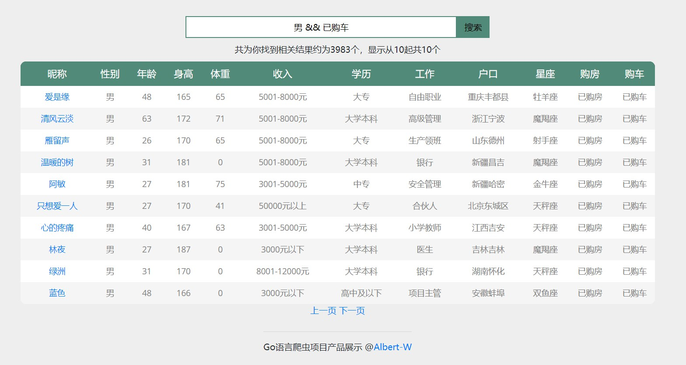
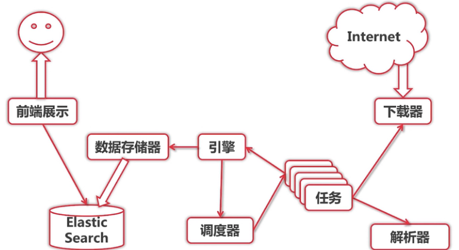
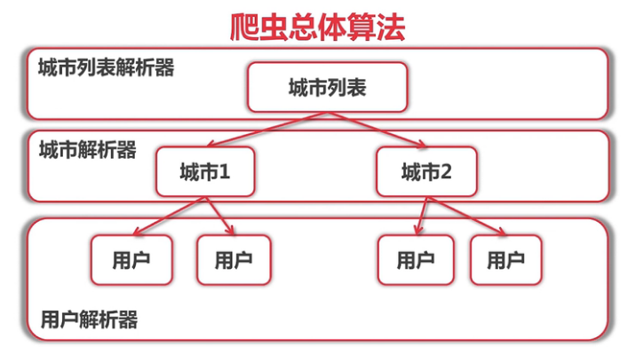

# Crawler-website
It's crawler website using Go language.

This is the mainPage

This is the homePage

## Features
- Go language
- Docker
- Elastic Search
- MVC pattern
- Microservices
- Singleton -> Concurrent -> Distribute

## Installation and go packages
- go language
- docker
- elasticsearch
- go get golang.org/x/text
- go get -v github.com/gpmgo/gopm
- gopm get -g -v golang.org/x/text
- gopm get -g -v golang.org/x/net/html
- go get gopkg.in/olivere/elastic.v5

## Usage for Concurrent
- Start Docker.
- Run Script "docker run -d -p 9200:9200 elasticsearch"
- Run "src/crawler/main.go", to start the singleton crawler.
- Run "src/crawler/frontend/starter.go", to view the result in the website.
- Visit "http://localhost:8888/" in your browser
- Type in query string with REST format. such as "女 && Age>20"

## Usage for Distribute
- Start Docker.
- Run Script "docker run -d -p 9200:9200 elasticsearch"
- Open a Terminal, execute: src\crawler_distributed\persist\server>go run ItemSaver.go --port=1234
- Open a Terminal, execute: src\crawler_distributed\worker\server>go run worker.go --port=9000
- Open a Terminal, execute: src\crawler_distributed\worker\server>go run worker.go --port=9001
- Open a Terminal, execute: src\crawler_distributed>go run main.go --itemsaver_host=":1234" --worker_hosts=":9000,:9001"
- Run "src/crawler/frontend/starter.go", to view the result in the website.
- Visit "http://localhost:8888/" in your browser
- Type in query string with REST format. such as "男 && 已购车"

## Architecture

## Framework

## Algorithm

## Reference 
- Google资深工程师深度讲解Go语言 @ https://coding.imooc.com/class/180.html
- Seed website: http://www.zhenai.com/zhenghun
